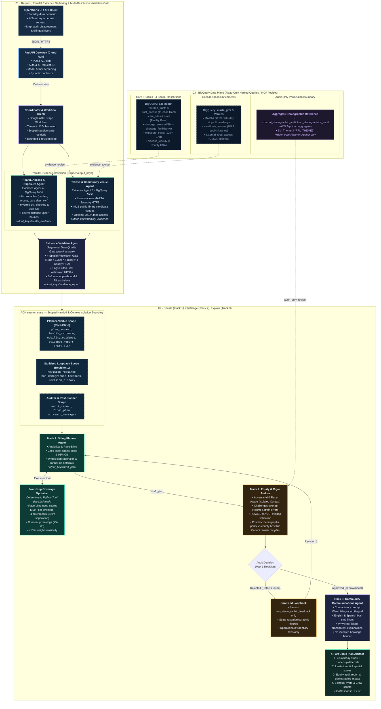

# CareBridge AI — System Architecture (Mermaid Diagram)

Generated from [`architecture_diagram.html`](file:///config/care_bridge/care-bridge-repo/architecture_diagram.html).

```mermaid
flowchart TD
    %% Section 01: Ingestion & Parallel Evidence Gathering
    subgraph S1["01 · Request, Parallel Evidence Gathering & Multi-Resolution Validation Gate"]
        CLIENT["<b>Operations UI / API Client</b><br/>• Thursday 4pm Scenario<br/>• 4-Saturday schedule request<br/>• Map, audit disagreement & bilingual flyers"]
        API["<b>FastAPI Gateway (Cloud Run)</b><br/>• POST /v1/plan<br/>• Auth & X-Request-ID<br/>• Model Armor screening<br/>• Pydantic contracts"]
        COORD["<b>Coordinator & Workflow Graph</b><br/>• Google ADK Graph Workflow<br/>• Timeout: 120s backstop<br/>• Scoped session.state handoffs<br/>• Bounded 1-revision loop"]

        CLIENT -->|JSON / HTTPS| API
        API -->|Orchestrates| COORD

        subgraph EVIDENCE_COLLECTION["Parallel Evidence Collection (Distinct output_keys)"]
            AGENT_HEALTH["<b>Health, Access & Exposure Agent</b><br/><i>Evidence Agent A · BigQuery MCP</i><br/>• 8 core tables (burden, access, care sites, etc.)<br/>• Inverted pct_checkup & 95% CIs<br/>• Federal distance upper bounds<br/><i>output_key='health_evidence'</i>"]
            AGENT_MOBILITY["<b>Transit & Community Venue Agent</b><br/><i>Evidence Agent B · BigQuery MCP</i><br/>• License-clean MARTA Saturday GTFS<br/>• IMLS public library candidate venues<br/>• Optional USDA food access<br/><i>output_key='mobility_evidence'</i>"]
        end

        COORD --> AGENT_HEALTH
        COORD --> AGENT_MOBILITY

        VALIDATOR["<b>Evidence Validator Agent</b><br/><i>Sequential Data-Quality Gate (check vs note)</i><br/>• 4-Spatial Resolution Gate (Tract ≠ 12km ≠ Facility ≠ 4-County HSA)<br/>• Flags Fulton 0/99 withdrawn HPSAs<br/>• Enforces upper-bound & PII exclusions<br/><i>output_key='evidence_report'</i>"]

        AGENT_HEALTH --> VALIDATOR
        AGENT_MOBILITY --> VALIDATOR
    end

    %% State Boundary
    subgraph SESSION_STATE["ADK session.state — Scoped Handoff & Context Isolation Boundary"]
        SCOPE_PLANNER["<b>Planner-Visible Scope (Race-Blind)</b><br/><code>plan_request</code>, <code>health_evidence</code>,<br/><code>mobility_evidence</code>, <code>evidence_report</code>, <code>draft_plan</code>"]
        SCOPE_LOOP["<b>Sanitized Loopback Scope (Revision 1)</b><br/><code>revision_required</code>,<br/><code>non_demographic_feedback</code>, <code>revision_history</code>"]
        SCOPE_AUDIT["<b>Auditor & Post-Planner Scope</b><br/><code>audit_report</code>, <code>final_plan</code>,<br/><code>outreach_messages</code>"]
    end

    VALIDATOR --> SESSION_STATE

    %% Section 02: Decide, Challenge, Explain
    subgraph S2["02 · Decide (Track 1), Challenge (Track 2), Explain (Track 3)"]
        PLANNER["<b>Track 1: Siting Planner Agent</b><br/>• Analytical & Race-Blind<br/>• Cites exact spatial scale & 95% CIs<br/>• Writes stop rationales & runner-up deferrals<br/><i>output_key='draft_plan'</i>"]
        OPTIMIZER["<b>Four-Stop Coverage Optimizer</b><br/><i>Deterministic Python Tool (No LLM math)</i><br/>• Race-blind need scores (100 - pct_checkup)<br/>• 4 catchments (≥5km separation)<br/>• Runner-up rankings (#5–#8)<br/>• ±15% weight sensitivity"]
        AUDITOR["<b>Track 2: Equity & Rigor Auditor</b><br/>• Adversarial & Race-Aware (Isolated Context)<br/>• Challenges overlap (&lt;5km) & grain errors<br/>• PLACES 95% CI overlap validation<br/>• Post-hoc demographic parity vs county baseline<br/><i>Cannot rewrite the plan</i>"]

        SESSION_STATE --> PLANNER
        PLANNER <-->|Executes tool| OPTIMIZER
        PLANNER -->|draft_plan| AUDITOR

        AUDITOR --> DECISION{"Audit Decision<br/>(Max 1 Revision)"}

        DECISION -- "Rejected (Defects found)" --> REVISE["<b>Sanitized Loopback</b><br/>• Passes non_demographic_feedback only<br/>• Strips race/demographic figures<br/>• Operational/evidentiary fixes only"]
        REVISE -->|Revision 1| PLANNER

        DECISION -- "Approved (or provisional)" --> COMMS["<b>Track 3: Community Communications Agent</b><br/>• Contradictory prompt: Warm 6th-grade bilingual<br/>• English & Spanish bus-stop flyers<br/>• 'Why Not Picked' transparent explanations<br/>• No invented bookings banner"]

        DELIVERABLE["<b>4-Part Clinic Plan Artifact</b><br/>1. 4 Saturday stops + runner-up deferrals<br/>2. Limitations & 4 spatial scales<br/>3. Equity audit report & demographic impact<br/>4. Bilingual flyers & CHW scripts<br/><i>PlanResponse JSON</i>"]

        COMMS --> DELIVERABLE
    end

    %% Section 03: Data Plane
    subgraph S3["03 · BigQuery Data Plane (Read-Only Named Queries / MCP Toolset)"]
        subgraph CORE_DATA["Core 8 Tables · 4 Spatial Resolutions"]
            DB_CORE["<b>BigQuery: a4i_health</b><br/>• burden_tracts & tract_access (11-char Tract)<br/>• care_sites & state (Facility Point)<br/>• shortage_areas (0/99) ≠ shortage_facilities (6)<br/>• exposure_tracts (12km Grid)<br/>• disease_weekly (4-County HSA)"]
        end

        subgraph OPTIONAL_DATA["License-Clean Enrichments"]
            DB_OPT["<b>BigQuery: marta_gtfs & Venues</b><br/>• MARTA GTFS Saturday stops & headways<br/>• candidate_venues (IMLS public libraries)<br/>• external_food_access (USDA, optional)"]
        end

        subgraph AUDIT_DATA["Audit-Only Permission Boundary"]
            DB_AUDIT["<b>Aggregate Demographic Reference</b><br/>• external_demographic_audit.tract_demographics_audit<br/>• ACS 5-yr tract aggregates<br/>• SVI Theme 3 (RPL_THEME3)<br/><i>Hidden from Planner; Auditor only</i>"]
        end
    end

    %% Data Connections
    DB_CORE -.->|evidence_toolset| AGENT_HEALTH
    DB_OPT -.->|evidence_toolset| AGENT_MOBILITY
    DB_AUDIT -.->|audit_only_toolset| AUDITOR

    %% Class styles
    classDef clientNode fill:#162c45,stroke:#28425a,stroke-width:1px,color:#edf5ff;
    classDef apiNode fill:#162c45,stroke:#6eabff,stroke-width:2px,color:#edf5ff;
    classDef coordinatorNode fill:#172940,stroke:#b5a0ff,stroke-width:2px,color:#edf5ff;
    classDef evidenceNode fill:#10243a,stroke:#41e4b4,stroke-width:1px,color:#edf5ff;
    classDef gateNode fill:#1c2541,stroke:#b5a0ff,stroke-width:2px,color:#edf5ff;
    classDef plannerNode fill:#0d3b35,stroke:#41e4b4,stroke-width:2px,color:#edf5ff;
    classDef auditorNode fill:#332410,stroke:#ffca76,stroke-width:2px,color:#edf5ff;
    classDef commsNode fill:#1d2440,stroke:#b5a0ff,stroke-width:2px,color:#edf5ff;
    classDef deliverableNode fill:#102b28,stroke:#41e4b4,stroke-width:2px,color:#edf5ff;
    classDef dbCore fill:#0c192b,stroke:#28425a,stroke-width:1px,color:#93aac4;
    classDef dbOptional fill:#0c192b,stroke:#28425a,stroke-dasharray: 5 5,color:#93aac4;
    classDef dbAudit fill:#1d182e,stroke:#74638e,stroke-width:1px,color:#d0b4ff;
    classDef stateBox fill:#10283b,stroke:#5a7b92,stroke-dasharray: 4 4,color:#e4f3ff;

    class CLIENT clientNode;
    class API apiNode;
    class COORD coordinatorNode;
    class AGENT_HEALTH,AGENT_MOBILITY evidenceNode;
    class VALIDATOR gateNode;
    class PLANNER,OPTIMIZER plannerNode;
    class AUDITOR,REVISE auditorNode;
    class COMMS commsNode;
    class DELIVERABLE deliverableNode;
    class DB_CORE dbCore;
    class DB_OPT dbOptional;
    class DB_AUDIT dbAudit;
    class SCOPE_PLANNER,SCOPE_LOOP,SCOPE_AUDIT stateBox;
```
